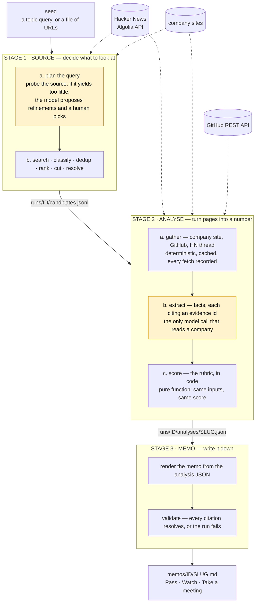
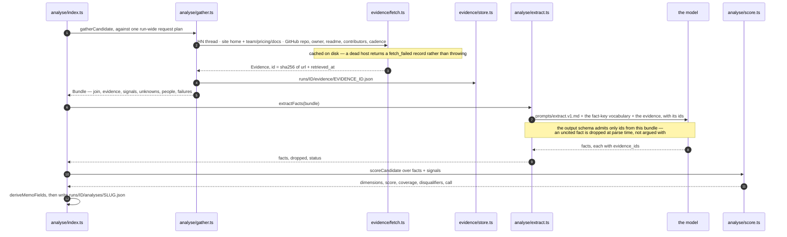
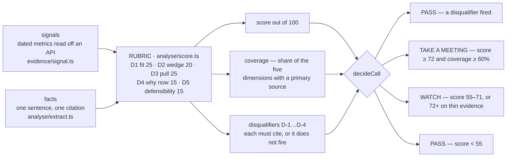

# investment-pipeline

An internal triage pipeline for a seed-stage VC firm. Point it at a topic; get
back a one-page investment memo per startup ending in a clear call —
**Pass / Watch / Take a meeting** — with every claim traceable to a source.

Sources from Hacker News, enriches from GitHub and company sites, scores against
one stated thesis, and renders memos. Three stages, file-based handoff, fully
replayable.

## Quickstart

```bash
./setup.sh                                          # deps, .env, offline self-check
./pipeline run --seed "AI agents for SMBs" --limit 15
```

`setup.sh` is idempotent, never overwrites an existing `.env`, and finishes by
re-rendering the committed sample run — so it proves the toolchain works before
you have obtained a single API key.

Memos land in `memos/<run_id>/`. `./pipeline --help` documents everything, and
[a sample run of 12 companies](memos/2026-08-23-ai-agent-infrastructure/) is
committed, so you can read real outputs without a key:

```bash
./pipeline memo --run 2026-08-23-ai-agent-infrastructure     # re-render, zero network
./pipeline run  --run 2026-08-23-ai-agent-infrastructure --seed "AI agent infrastructure" --replay
pnpm test                                              # offline, no key required
```

The `--replay` line re-runs **all three stages** without a network call or a
token: stage 1 reads the candidates it decided, stage 2 reads
`runs/<id>/bundles/` and the committed LLM cache, stage 3 re-renders
([ADR-0009](docs/adr/0009-bundles-as-artifacts.md)).

> **Read [docs/STATE.md](docs/STATE.md) before trusting a number in those
> memos.** The twelve calls were read by hand and one of them is wrong — a
> disqualifier fired against evidence quoted two sections above it in the same
> memo. The rubric is also unvalidated by design: there is no eval harness, and
> [SCOPE.md](docs/SCOPE.md) says why it was cut.

If a topic query returns too little to work with, stage 1 says so and offers
refinements rather than silently proceeding with four bad candidates. Whatever
you choose is committed to `query_plan.json`, and replays never ask again.

## The thesis

> We back technical founders building AI-native infrastructure that developers
> adopt before it is sold to them.

Scored across five weighted dimensions with anchored bands, plus four
disqualifiers that pass on a company regardless of score. Scoring is
deterministic code over facts extracted from cited evidence — never a number
asked of a model — so any score is recomputable by hand from the analysis JSON.
Full rubric: [docs/SPEC.md](docs/SPEC.md).

## How it works

Each stage is a function from one on-disk artifact to another with a Zod
contract at the boundary, so any stage can be re-run from the previous stage's
output without re-running the ones before it, and no stage imports another's
internals.

```
seed → SOURCE → candidates.jsonl → ANALYSE → analyses/*.json → MEMO → memos/*.md
                                   ├ gather   deterministic, cached, cited
                                   ├ extract  LLM → facts + evidence ids
                                   └ score    pure rubric, no LLM
```

### High level



The two shaded boxes are the only places a model runs. It is allowed at
**widening** boundaries — deciding what to look at — and forbidden at
**narrowing** ones — deciding what to conclude. Everything before extraction is
retrieval; everything after it is arithmetic and templating. That is what makes
a score recomputable by hand and a memo auditable
([ADR-0002](docs/adr/0002-deterministic-scoring.md),
[ADR-0008](docs/adr/0008-query-planning.md)).

### Low level — one candidate, end to end



A candidate that goes wrong does not cost the run. An unreachable site becomes a
`fetch_failed` record and lowers coverage; a model that returns nothing readable
twice marks the candidate `partial` and the memo says so. Only a broken
invariant — a memo citing an evidence id that does not exist — stops the build
([ARCHITECTURE §5](docs/ARCHITECTURE.md)).

### Low level — where the score comes from



An uncovered dimension scores at a documented floor, never at zero, and is
listed in the memo's *What we could not verify*. Full rubric with the band
anchors: [docs/SPEC.md](docs/SPEC.md).

### Low level — module map

```mermaid
flowchart TB
    CLI["src/cli.ts — commands, flags, exit codes"] --> PIPE["src/pipeline.ts — run = source + analyse + memo"]

    subgraph L1["stage 1 · src/source/"]
      direction TB
      I1["index.ts — plan → search → classify → dedup → rank → cut → resolve"]
      PL["plan.ts — probe, clarify once, query_plan.json"]
      HNA["hn.ts — Algolia urls, four expansion arms, parse, classify"]
      RS["resolve.ts — post url → company site, canonicalise, group duplicates"]
      CD["candidate.ts — resolved site → Candidate; the URL-list seed form"]
      I1 --> PL & HNA & RS & CD
    end

    subgraph L2["stage 2 · src/analyse/ and src/evidence/"]
      direction TB
      I2["index.ts — gather, extract, score, write, meter, report"]
      BD["budget.ts — one request plan for the whole run, before the loop"]
      GA["gather.ts — one Bundle per candidate, joining repo ↔ site both ways"]
      SA["evidence/site.ts — home page plus team, pricing, docs"]
      GHB["evidence/github.ts — repo, owner, readme, contributors, cadence"]
      SG["evidence/signal.ts — dated, cited metrics — a missing value is an unknown"]
      BS["bundles.ts — Bundle ↔ runs/ID/bundles/SLUG.json"]
      KY["keys.ts — the fact-key vocabulary the rubric switches on"]
      EX["extract.ts — render, call, retry once, drop uncited facts"]
      SO["score.ts — the rubric; the only place a score is created"]
      DV["derive.ts — analysis → memo bullets, caps, upgrade trigger"]
      I2 --> BD & GA & EX & SO & DV & BS
      GA --> SA & GHB
      SA & GHB --> SG
      EX --> KY
    end

    subgraph L3["stage 3 · src/memo/"]
      direction TB
      I3["index.ts — render and validate every memo before writing any"]
      RN["render.ts + templates/memo.md.eta"]
      VL["validate.ts — citations resolve, sources table, header score"]
      I3 --> RN & VL
    end

    subgraph SH["shared"]
      direction TB
      FE["evidence/fetch.ts — the only module that touches the network"]
      ES["evidence/store.ts — content-addressed evidence records"]
      PR["llm/prompt.ts — versioned prompt files with front matter"]
      PV["llm/provider.ts — openai | anthropic behind one interface"]
      LC["llm/cache.ts — .cache/llm/HASH.json"]
      CT["contracts/*.ts — the Zod stage boundary, each versioned"]
      MF["manifest.ts · run.ts · config.ts — run record, paths, env"]
    end

    PIPE --> I1 --> I2 --> I3
    HNA & RS & SA & GHB & GA -.-> FE
    GA -.-> ES
    I3 -.-> ES
    EX -.-> PR & PV & LC
    I1 & I2 & I3 -.-> CT
    I1 & I2 & I3 -.-> MF
```



`src/evidence/fetch.ts` is the choke point: no stage calls `fetch` directly, so
every retrieval is cached, dated and written to the evidence store. Stages know
nothing about each other beyond the contracts in `src/contracts/`.

### What lands on disk

| Artifact | Written by | Read by | Contract |
|---|---|---|---|
| `runs/ID/query_plan.json` | 1a | 1b, replay | `QueryPlan` |
| `runs/ID/candidates.jsonl` | 1 | 2 | `Candidate` |
| `runs/ID/evidence/*.json` | 2a | 2b, 3 validator | `Evidence` |
| `runs/ID/bundles/*.json` | 2a | 2b, replay | `Bundle` |
| `runs/ID/analyses/*.json` | 2c | 3 | `Analysis` |
| `runs/ID/manifest.json` | all three | a reviewer | per-stage records |
| `memos/ID/*.md` | 3 | a partner | SPEC §4 |
| `.cache/http/` · `.cache/llm/` | fetch, extract | a replay | raw bodies local, LLM responses committed |

Every factual claim in a memo carries an evidence id resolving to a committed
JSON record with the source URL and its retrieval timestamp. The validator fails
the run if a memo cites a source that does not exist — the model can be wrong
about what a source says, but it cannot invent one.

Replay is a property of this layout rather than a feature bolted onto it:
`--replay` reads `bundles/` and `evidence/` instead of fetching, and answers
model calls from `.cache/llm/`, whose key is a hash over provider, model, prompt
id, prompt version, output schema version and the rendered input. A prompt or
schema bump changes the key, so a stale response can never silently survive a
change. Details in [docs/ARCHITECTURE.md](docs/ARCHITECTURE.md).

## Repo map

| Path | What |
|---|---|
| [docs/SPEC.md](docs/SPEC.md) | Thesis, rubric, call thresholds, memo contract |
| [docs/ARCHITECTURE.md](docs/ARCHITECTURE.md) | Stages, contracts, replay, failure policy |
| [docs/STATE.md](docs/STATE.md) | Current phase, open decisions, next step — **start here** |
| [docs/tickets/](docs/tickets/) | The backlog — 30 tickets in dependency order, 27 Done |
| [docs/SCOPE.md](docs/SCOPE.md) | What is not being built, and why |
| [docs/TESTING.md](docs/TESTING.md) | What is tested, what is not, and the eval harness that was cut |
| [docs/adr/](docs/adr/) | Nine decision records, each with the rejected options |
| [docs/worklog/](docs/worklog/) | How this was actually built, session by session |
| [CLAUDE.md](CLAUDE.md) | Operating guide for AI assistants in this repo |

## How this was built

Built with heavy use of Claude Code, deliberately and on the record.
[docs/worklog/](docs/worklog/) is a dated account of each session: what the AI
proposed, what I took, what I overrode, and where its first answer was not its
best one. [docs/adr/](docs/adr/) carries the decisions themselves with the
options that lost. Attribution is per-artifact and explicit — where a module was
AI-written end-to-end, the worklog says so.
